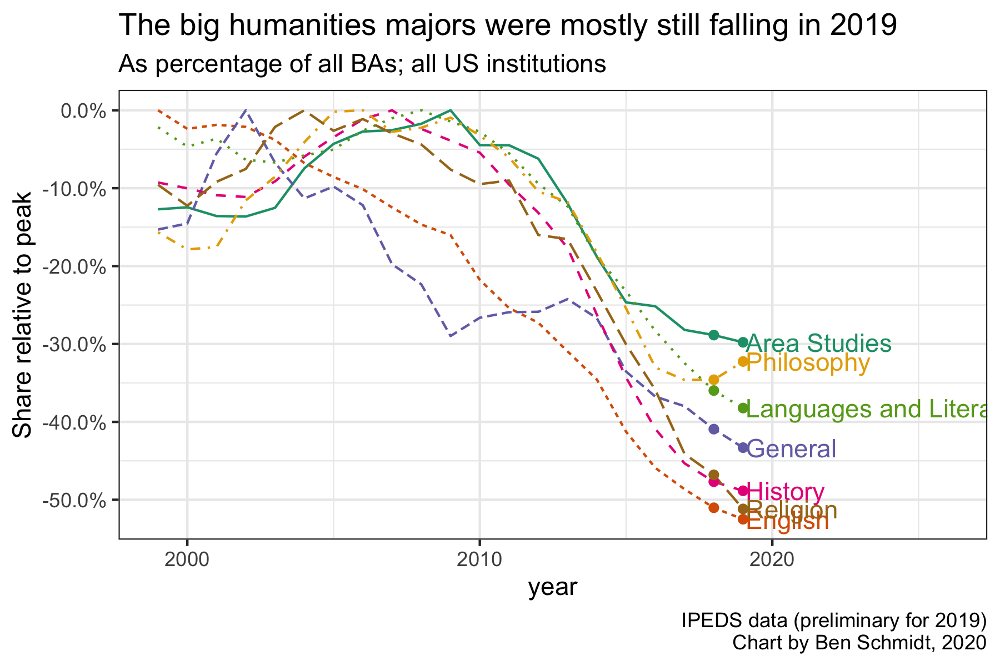
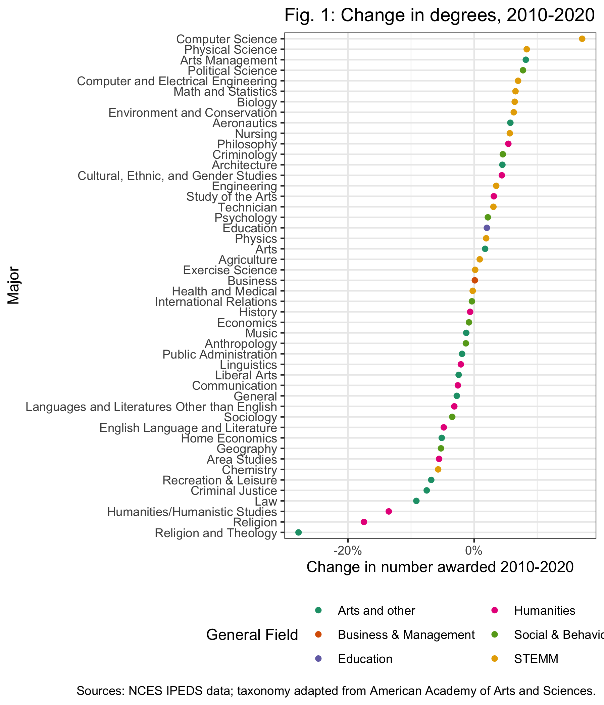
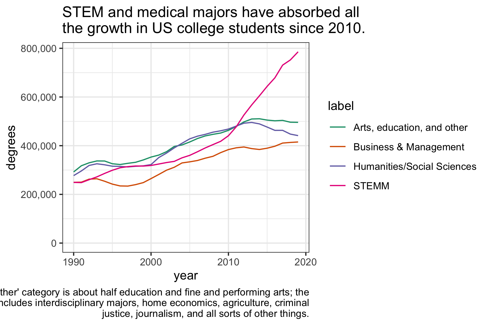

Every year, I run the numbers to see how college degrees are changing. The Department of Education released
this summer the figures for 2019; these and next year's are probably the least important that we'll ever see, since they capture the weird period as the 2008 recession's shakeout was wrapping up but before COVID-19 upended everything once again. But for completism, it's worth seeing how things changed.

First, the chart of humanities majors compared to peak. Here, things remain at
their post-2015 level.

Next, the decade-horizon rate of change for all majors. Again, the humanities are at the bottom
of the list; the most remarkable feature here is that computer science, already large,
has been growing at a huge rate in the last few years.

Next, what I think is the most important full overview you can get: a four-type
division of US college majors since 1990. This makes clear that the basic
story of the last decade was the growth of STEM at the expense of pretty much all
other forms of education.

Rate of change is important, but it's worth looking at the overall numbers too.
Here are 20 years of majors for all the humanities fields. The American Academy
includes several communications majors as humanities fields; I think that in
method and substance they're closer to a qualitative social science, but I
include them here anyway.

