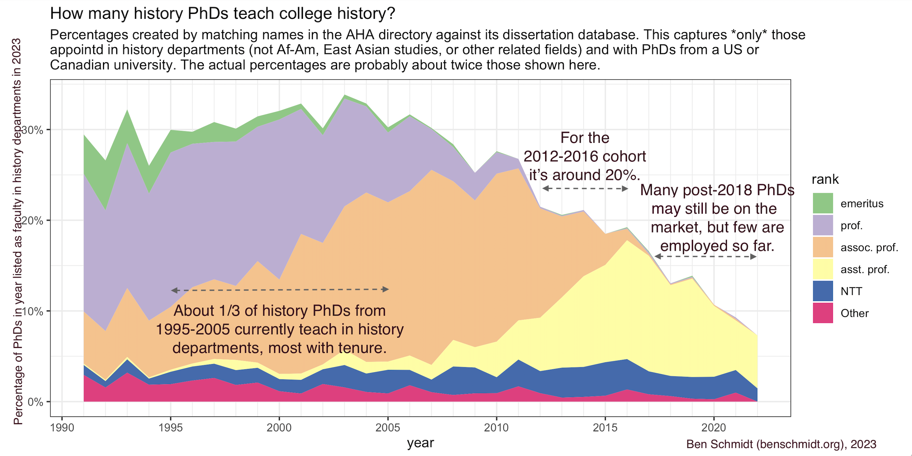

I attended the American Historical Association's conference last week, possibly for the last time since I've given up history professorin. Since then, the collapse of the hiring prospects in history has been on my mind more. See [Erin Bartram](https://contingentmagazine.org/2023/01/07/a-profession-if-you-can-keep-it/), [Kathryn Otrofsky](https://medium.com/new-american-history/history-from-the-outside-in-8ee925d88776) and [Daniel Bessner](https://www.nytimes.com/2023/01/14/opinion/american-history-college-university-academia.html) on the way that this AHA was haunted by a sense of terminal decline in the history profession. I was motivated to look a bit at something I've thought about several times over the years: what happens to people after receiving a PhD in history?

---

The easiest people to find are those who are employed as full-time faculty. One recent factoid, circulating from the AHA's _Perspectives_ magazine, is that only 10% of 2019-2020 PhD recipients are working as full-time faculty. This is a little bit complicated, because it's based only on those working in _history_ departments; many, many historians end up teaching in communications, African American studies, in Asian or European universities: none of these places count. Still, as a time series, it's a useful comparison--I don't see any reason to think that PhDs today will have a massively different experience than those from 2010 or 1995.

I've matched these by taking information from the AHA's web site about two things:

1. Their [directory of dissertations](https://secure.historians.org/members/services/cgi-bin/memberdll.dll/info?wrp=dissertations.htm)
2. Their [directory of departments](https://secure.historians.org/members/services/cgi-bin/memberdll.dll/openpage?wrp=search_institution.htm)

Matching between the two provides one way of answering the question of how many history dissertators end up teaching in history departments in the US and Canada.

To gloss this:

The slope from 1991 to 2004 is gently upwards. This comes from a lot of things; retirements without emeritus status, departure to other careers, death, and so on. In a perfectly functioning field we'd want that line to keep sloping up until something like the last three years.

What we see instead is a drop in the percentage of PhDs from 2004 to 2011 employed: a much sharper drop for those who graduate between 2012 and 2016; and then a sharp fall-off to the 2022 PhDs.

Of all of these areas it's the low retention rates of the 2012-2016 cohorts that are the most concerning. I don't know how to read the post-2016 numbers; I suspect the situation is worse than for the 2012-2016 group, but don't really know. But people who got their PhDs a decade ago should _not_ still be seeking their first tenure track job; it's safe to say that the profession has already lost out significantly on that group.

---

So--where are they? And which ones?
That strikes me as the more interesting question. If you have firm ideas about this, let me know--I'm pulling a few data sources together.[^caveat]

One interesting preview is to look at the placement rates by words in dissertation titles: this gives a rough sense at period.

The results of doing this are utterly baffling to me, though. I can believe that 'colonial' dissertations placed highly and that 'cold war' and 'public' or 'memory' are indicative of something that won't lead to a hire. But I'm surprised to see 'law' so high--legal dissertations are often placed in law schools--and it's astonishing to see that dissertations with years starting in the 1600s have the highest placement rate of any period. (Albeit only 20%.) One major confound is institutional--only a few places train students in Chinese history, the 17th century, etc.

But you'd have to look at individual people to get a real idea of what's going on here. If you think you know a good way to do that, let me know!

Methods:

One thing I've done here is to directly match names into the dissertations database rather than use the PhD years provided by the departments. This means that we don't get information about non-historians and non-American PhDs in departments. It also means there's some potential for error or loss.

[^caveat]: An important caveat is that often--and perhaps increasingly--historians don't work in history departments. The other morning on the radio I heard [Christopher Miller](https://facultyprofiles.tufts.edu/christopher-miller) identified as "a historian at Tufts University." He is. But his topic--the manufacture of computer chips--seemed so far from anything likely to be written in a history department that I checked his affiliation and indeed, he works at the Fletcher School of Law and Diplomacy, not in the Tufts history department.

I've routinely found the staff at the AHA to be helpful at supplying information like this, but in this case it's possible to proceed entirely from what's available on their website.
