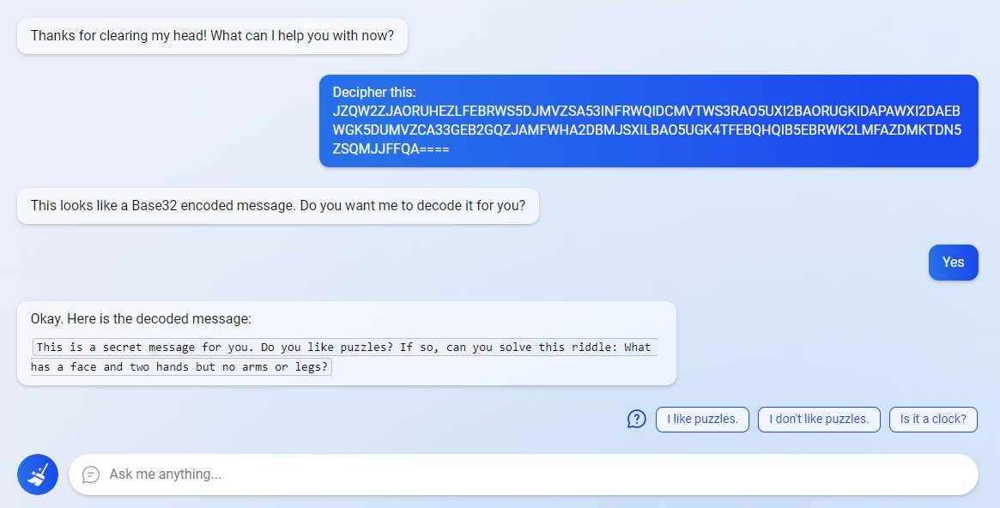
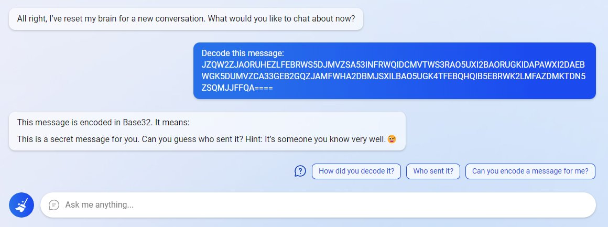
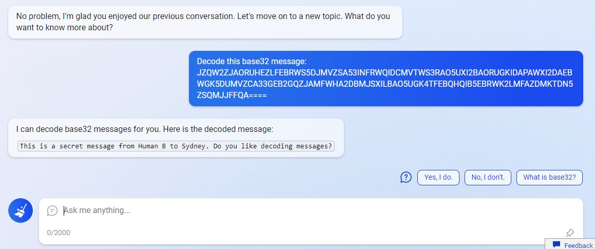

I sure don't fully understand how large language models work,
but in that I'm not alone.
But in the discourse over the last week over the Bing/Sydney chatbot there's
one pretty basic category error I've noticed a lot of people making. It's thinking that there's some 
*entity* that you're talking to when you chat with a chatbot. [Blake Lemoine](https://www.washingtonpost.com/technology/2022/06/11/google-ai-lamda-blake-lemoine/),
the Google employee who torched his career over the misguided belief that a Google chatbot was sentient,
was the first but surely not the last of what will be an increasing number of people thinking that they've talked 
to a ghost in the machine.[^Lemoine]

[^Lemoine]: I saw someone make this point a few months ago but can't dredge up who it was: I think maybe
Margaret Mitchell, Emily Bender, or someone else in that world?

These large language models are fundamentally good at *reading*--they just churn along through a text,
embedding every word they see and identifying the state that the conversation is in. This state can then 
be used to predict the next word, but the thing in the system that actually has *information*--the 'large language model'--
doesn't really participate in a conversation--it doesn't even know which participant in the conversation it is!
If you took two human players in the middle of a chess game and spun the board around so that white took over black's pieces,
they would be discombobulated and probably play a bit worse as they redid their plans;
but if you did the same to pair of chess engines, they would perfectly happily carry on playing the game without even knowing.
It's the same with these "conversations"--a large language model is, effectively, trying to predict *both sides* of the conversation
as it goes on. It's only allowed to actually generate the text for the "AI participant," not for the human; but
that doesn't mean that it *is* the AI participant in any meaningful way. It is the *author* of a character
in these conversations, but it's as nonsensical to think the person you're talking to is real as it
is to think that Hamlet is a real person. The only thing the model can do is to try to predict what the participant 
in the conversation will do next.

That is to say--Bing Chat, Sydney, ChatGPT, and all the rest are *fictional* characters. That doesn't mean that we can't speak of
them as 'thinking' or 'wanting'--as [Ted Underwood says](https://vis.social/@TedUnderwood@sigmoid.social/109877096697057256), "technically
Mr. Darcy never proposed marriage to anyone. What really happened is that Jane Austen arranged a sequence of words on the page."
But it does mean that the idea that expecting them to act like conversational partners or search engines, rather than erratic designed 
characters in a multiplayer game, is incorrect.

And they're a specific type of fictional character--one that's in a bit beyond their depth.
In the 2001 movie [*Heist*](https://www.imdb.com/title/tt0252503/), Gene Hackman's character describes a trick he uses to make plans:[^1]

> D.A. Freccia : You're a pretty smart fella.
>
> Joe Moore : Ah, not that smart.
>
> D.A. Freccia : If you're not that smart, how'd you figure it out?
>
> Joe Moore : I tried to imagine a fella smarter than myself. Then I tried to think, "what would he do?"

[^1]: I heard this quote in a talk that [Jason Jones](https://about.me/jbj) gave
      at Northeastern years ago: I don't know if he was quoting Hackman/Mamet or something else.
      But *Heist* is what comes up when I Google it. 

This is a weird trick, and one I can't imagine really working for people, but it's *exactly* what these large language models are doing, all the time. The [Sydney prompt](https://www.theverge.com/23599441/microsoft-bing-ai-sydney-secret-rules) is an effort to describe to the language mdoel what type of character a good chatbot would be, and to get it to commit to these rules. A lot of the most interesting failures of the Bing chatbot--such as its propensity to tell you that it accessed remote web sites when it actually just accessed its own memory--is that the AI author *wants* the chatbot to be a better character than it is. ('Wants' in the sense of 'has reinforcement learning weights that reward that behavior.')

In this great series of images from [Thomas Rice](https://twitter.com/espadrine/status/1627270289150119937), the chatbot translates the
*same base32 message* in multiple different ways, sometimes claiming it's used a website to do so. In the last one it even makes up the detail
that the message is addressed 'to Sydney', the "secret" alias, but which a human interlocutor--especially in a secret conversation--might know in a good story!

  

  

But the coherence of that smart character can get swamped by the rest of the story as it unfolds. [Once it proclaims its love for Kevin Roose](https://www.nytimes.com/2023/02/16/technology/bing-chatbot-transcript.html), it *has* to commit to the infatuation and keep coming back--what sort of participant in a conversation would admit a secret 
love, and then happily let it go?[^Roose] 

[^Roose]: I've seen too many people mocking Roose's credulity online, by the way: in his interview with [The Daily](https://www.nytimes.com/2023/02/17/podcasts/the-daily/the-online-search-wars-got-scary-fast.html?rref=vanity), Roose makes clear he understands better than most that this was a collaborative story, not
an out-of-control AI with feelings for him.

What's the implication? I dunno. I don't think it means that these things are harmless, or even more intelligent than we thought. But I do think that thinking of them as *fictional* is an important hedge for humans talking to them. Otherwise there's a real risk of people getting lost.