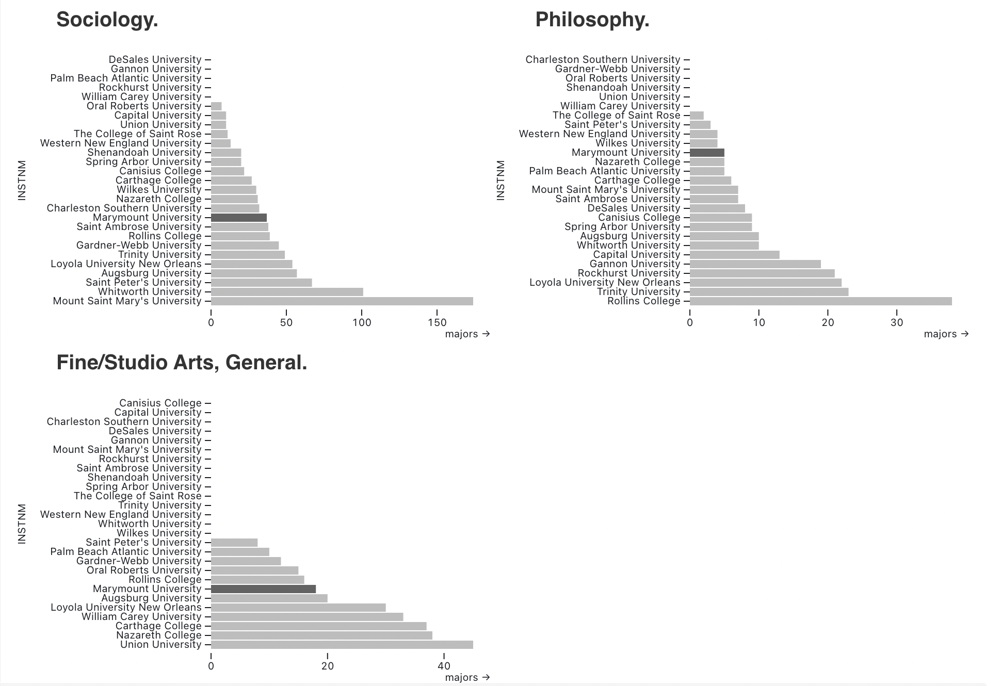

Recently, Marymount--a small Catholic university in Arlington, Virginia--has been in the news for a draconian
plan to eliminate a number of majors, ostensibly to better meet student demand. I recently learned the university
leadership has been circulating one of my charts to justify the decision, so I thought I'd chime in on the context a bit. 
My understanding of the situation, primarily informed by the coverage in [ARLNow](https://www.arlnow.com/tag/marymount-university/),
is this seems like bad plan,[^bad] so I thought I'd take a quick look at the university's situation. 

[^bad]: From a PR perspective, among other things--if I had heard of Marymount before this, I forgot; but now it's widely known
for advertising that it's in financial peril by executing a plan that is unlikely to save it any significant amount of money, which
is not a great way to attract talented students or retain talented employees. Bryan Alexander, the 'futurist' who apparently showed my
Twitter chart to some set of Catholic universities, uses the phrase ["Queen Sacrifice"](https://bryanalexander.org/higher-education/another-queen-sacrifice-might-be-in-the-works-this-time-in-virginia/)
to describe cutting a department to save a university; what Marymount's doing, cutting the majors while retaining the departments,
seems to be just folly.

Not knowing much about Marymount, I thought I'd first check how low the major numbers actually are. Here's the list of all the majors that Marymount reported to [IPEDS](https://nces.ed.gov/ipeds/)
from 2017-2021. Majors proposed for removal are in blue. The largest group are Nursing majors; the next largest are general business, a category that has stagnated.
The two largest majors in what used to be called the "Liberal Arts" are psychology and biology; arrows show change from the 2005-2015 period to the 2017-2021 period.

A few things jump out at me here.

1. The proposed cut majors are doing perfectly well. The annual numbers in history have declined only about 15%; that's significantly better than most history programs. 
   The sociology program, slated for removal, has actually grown. 
2. If you want to cut a major at Marymount, you should cut Liberal Arts and Sciences/Liberal Studies. It has declined greatly, it provides no benefit over any specific 
   course of study, and it's where a number of the students that would have majored in the majors slated for removal are likely to go. This does them no good;
   general liberal arts degrees tend to be a characteristic of community colleges looking to set students up to complete a major inside of two years if they move
   to a four-year institution, but for a four-year degree they're just dead weight.

The first point is especially important--there doesn't seem to be anything particularly low about these numbers. Universities routinely offer majors that graduate fewer
than 10 students a year. Marymount itself has several other ones. Let's compare to some peers. Marymount offered 3,223 degrees from 2016-2021. Let's make a group of other schools
that are private, offer MAs but not many PhDs (that is, are Carnegie class Masters 1 and Masters 2), and granted between 3000 and 3500 degrees over the same period.[^data]

[^data]: All the data and charts for this post, including national degree numbers, are in an Observable Notebook [here](https://observablehq.com/@bmschmidt/marymount-degrees).

Looking at this, it's clear that Marymount's major numbers are not in any way remarkable; making cuts of these majors in the context of national trends is a wildly speculative 
gamble on the university's character that other comparable places aren't doing. I don't know the specific finances, but from a positioning standpoint, Marymount is 
making a peculiar choice. The school in this bucket with the weakest humanities programs is the evangelical Oral Roberts University; for a Catholic school to aspire to supplant
them is uninspiring, to say the least.

## Majors since 2016 at Marymount and similar schools

  

  