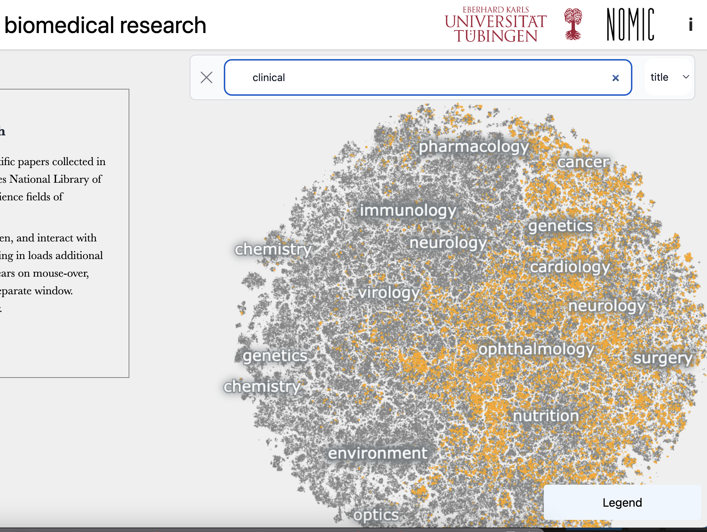

Last week we released a big data visualiation in collaboration with the [Berens Lab](https://www.eye-tuebingen.de/berenslab/) 
at the University of Tübingen. It presents a rich, new interface for exploring an extremely large textual collection.

Because I can I'll simply embed it below--but you'll have a better experience reading it [at the original site](https://static.nomic.ai/pubmed.html).

---

<iframe src="https://static.nomic.ai/pubmed.html" width="100%" height="600px" style="border: none;"></iframe>

Rita Gonzalez-Marquez is the lead author of the paper and did the primary analysis; the embedding here was carefully created 

