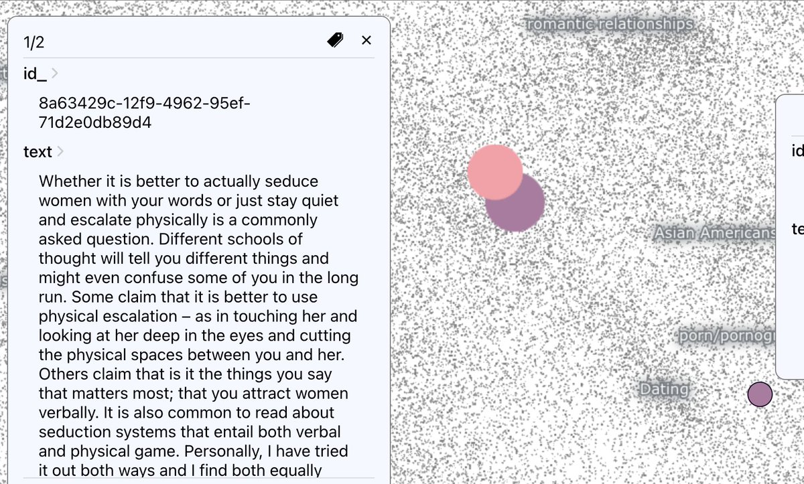

*This is a [Twitter thread from March 14](https://twitter.com/benmschmidt/status/1635692487258800128) that I'm cross-posting here. Nothing massively original below. It went viral because I was one of the first to extract the ridiculous paragraph below from on the release of GPT-4, and because it expresses some widely shared concerns. *

:::tweet

I think we can call it shut on 'Open' AI: the [98-page paper](https://cdn.openai.com/papers/gpt-4.pdf) introducing GPT-4 proudly declares that they're disclosing *nothing* about the contents of their training set.

>  Given both the competitive landscape and the safety implications of large-scale models like GPT-4, **this report
> contains no further details about the architecture (including model size), hardware, training compute,
> dataset construction, training method, or similar.**
> 
> We are committed to independent auditing of our technologies, and shared some initial steps and
> ideas in this area in the system card accompanying this release.2 We plan to make further technical
> details available to additional third parties who can advise us on how to weigh the competitive and
> safety considerations above against the scientific value…

:::

---

:::tweet
Why should you care? Every piece of academic work on ML datasets has found consistent and problematic ways that training data conditions what the models outputs. (
@safiyanoble
, 
@merbroussard
, 
@emilymbender
, etc.) Indeed, that's the whole point! That's what training data is!
:::

:::tweet
Choices of training data reflects historic biases and can inflict all sorts of harms. To ameliorate those harms, and to make informed decisions about where a model should *not* be used, we need to know what kinds of biases are built in. OpenAI's choices make this impossible.
:::

:::tweet
Neural networks like GPT-4 are notoriously black boxes; the fact that their operations are unpredictable and inscrutable is one of *the* most important questions about whether and where they should be used. And now OpenAI is planting a standard to extend that mystery farther.
:::

:::tweet
Their argument is basically a combination of 'trust us' and 'fine-tuning will fix it all.' But the way they've built corpora in the past shouldn't inspire trust. When OpenAI launched GPT-2, their brilliant idea was to find 'high quality' pages by using Reddit upvotes.
:::

:::tweet
That probably beats the morass of regular web text, but the idea of Reddit upvotes as the gold standard for quality is--distopian? Last week we made a map of the open recreation of this corpus, OpenWebText-- it's crazy easy to find awful stuff. Try it! [Common Crawl OWT Atlas Map](https://atlas.nomic.ai/map/owt)

:::

:::tweet
For GPT-3 that set served as a standard to filter sites out from the Common Crawl. We made a map of the Pile reproduction of that. I have no idea if OpenAI filtered stuff like the below out, or if r/the_donald gave it upvotes in the day. Neither do you. [Common Crawl 8M Atlas map](https://atlas.nomic.ai/map/cc8m)
:::

:::tweet
Here's a link to the paper. The whole thing is an fascinating artifact--it looks like an arxiv paper using the neurips latex template (
@andriy_mulyar
 pointed this out), but it's posted on their own web site and is authored by a company, not people.  https://cdn.openai.com/papers/gpt-4.pdf
 
:::

:::tweet
One last point from the comments: it's hard to believe that 'competition' and 'safety' are the only reasons for OpenAI's secrecy, when hiding training data makes it harder to follow the anti-Stability playbook and sue them for appropriating other's work. [More on the stability lawsuit](https://www.reuters.com/legal/transactional/lawsuits-accuse-ai-content-creators-misusing-copyrighted-work-2023-01-17/)
:::