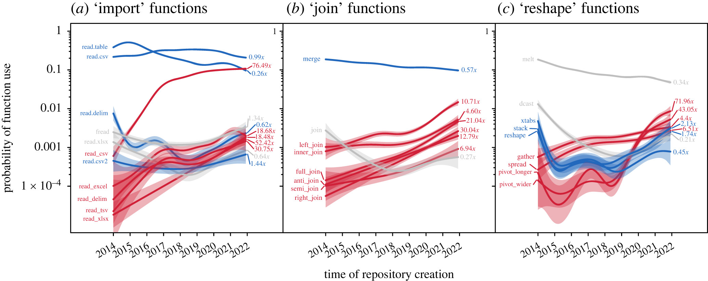

The 'R' language was the first one that I used seriously, starting way back in 2004, and it still remains one 
of my favorites. It's a general language, 
serves as an interesting model for how a language can prioritize user experience and fluency. At Nomic most of
the lasting commits I've made have been in either typescript or Python, but I still continuously find myself
firing up R studio for one-off analyses.

So I was excited to see an article by Timothy Staples in Royal Society Open Science titled ["Expansion and evolution of the R programming language"][^2]
Staples formalizes and describes something extremely interesting that's been happening in R over the last decade; 
the bifurcation into two dialects, based around the old core R and the new [Tidyverse](https://www.tidyverse.org/). Staples promises
in the abstract to show "provide evidence that users can change the nature of programming languages, with patterns that match known processes from natural languages and genetic evolution." So I thought I'd capture some highlights and do some post-publication peer review as I read.

------

The data here is fairly large: 700,000 github repos from 2014-2021, about a quarter of a billion function calls with 2 million distinct names.[^Q1]

The most valuable information here is the *time* that things were created. Staples can get the date at which a repo was authored and trace
the changes in the language.[^Q3] This makes it possible to track the spread both of new functions, and of what he calls 'synonymic' functions: 
cases where a multiple functions do essentially the same thing (like read a CSV.)

![Staples' caption: "Trends over time in the use of individual R (a) functions and (b) packages. Plots are ‘word shift graphs', with y-axis scores reflecting probability a function was used in a GitHub repository in December 2021, and the slope of change in this probability over time on the x-axis. Point colours reflect function category: functions from the base R installation (blue), the tidyverse collection of packages (red) and all other community packages (grey). Some functions from figure 3 are labelled here. Grey dashed line represents a zero slope where function use did not change over time. Shaded grey area highlights an area with small changes that were close to zero. Data and values for each function and package are available in electronic supplementary material, table S1–S2.](20230413062121.png)


Staples also offers what he describes alternatively as 'replacement' and 'diversification' of core R functions by tidyverse equivalents: 


[^Q1]: Staples 'used a custom function-extracting algorithm that captured text to the left of an open parenthesis (‘(’), the syntax for a function call in R.'. 
       It's too bad that he didn't simply parse the AST; if there's one thing that every language offers, it's a method for parsing it's own
       syntax tree! Later in the paper he doubles down on his assertion by saying "that function calls are always paired with parentheses. This grammar has not changed over time, and there currently no competing methodology for this approach." This isn't actually true! Back in 2018 I wrote a lot 
       of code that looked like this:

       ```r
       dataset %>% 
         arrange(size) %>%
         head %>%
         reverse
       ```

       where `head` and `reverse` are functions that take a single argument, and the `%>%` pipe doesn't require parantheses. The newer R `|>`
       (which came in after the end of the period described in this paper) does require parentheses all the time.

[^Q3]: Staples "removed scripts from 138 872 repositories that were updated 12 months or more after their initial creation date." This seems
       like an unfortunate omission, because it is possible to capture the state of a single repo at multiple points in time. Given that 
       the ways that cohort succession impacts language in literary culture [Cohort succession explains most change in literary culture. T Underwood, K Kiley, W Shang, S Vaisey. *Sociological Science* 9, 184-205](https://sociologicalscience.com/articles-v9-8-184/), it would be useful at some point to look into the ways that this is or isn't true of R.

[^2]: Staples Timothy L. "Expansion and evolution of the R programming language". *R. Soc. open sci.*, April 12 2023. [doi/10.1098/rsos.221550](https://royalsocietypublishing.org/doi/10.1098/rsos.221550)

