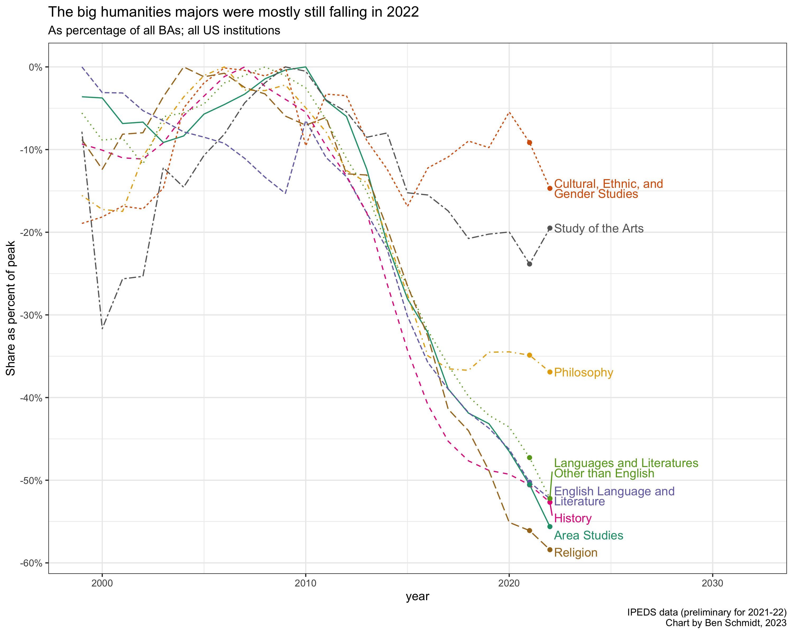

When I wrote [last October](https://benschmidt.org/post/2022-10-27-career-news/) about
how I was leaving the academy after 9 years as a history professor, to join the AI startup
[Nomic](https://nomic.ai), I wrote about how odd it felt to be leaving the humanities
just as it felt like they were falling apart.

> Some of our redoubts dealing with a slight fire and brimstone problem–
> I’m sure I’ll take some chances to look back on those bigger 
> questions soon. But not too soon–don’t want to turn into a pillar of salt.

I've ventured back into humanities commentary a couple times since--
especially when 
[Marymount University proposed to cut several humanities majors](https://benschmidt.org/post/2023-03-04-marymount/)
and when [Gordon Gee's administration announced a plan for firing faculty at West Virginia University
as colossally misguided as their financial mismanagement over the last decade.](https://twitter.com/benmschmidt/status/1689970998819295232)
But last week the Department of Education finally released its nationwide counts of college majors,
a time series that I've been checking regularly for 20 years now, since drafting the first version of the 
[American Academy of Arts and Sciences' *Humanities Indicators*](https://www.amacad.org/humanities-indicators).

Majors aren't the best data we could want about the humanities, but they are the 
best long-term data we *have*. Every year, students choose majors; every year, the 
federal government reports them in a consistent time series. And every year since about 2010,
those numbers have been *terrible* for just about every humanities field. We'll talk about 
some of the quibbles people have later. But for now--this is the best place to start.

## 2022: More bad news.

The topline numbers for humanities fields are bad as they've been.
The three largest traditional subfields--English literature, foreign languages, and history--
are all down almost exactly 52% compared to their peak share of degrees in the 2000s; 
history and English each fell 6.5% this last year, while foreign languages fell
an astounding 11.0% in just one year (from 13,018 to 11,500).[^overall]

[^overall]: Overall degree numbers are down a bit, so this is 'only' a 9.4% drop compared
            if you think about this in terms of share of BAs, not absolute numbers.

Smaller fields also fell. Area Studies and religion are doing even worse than 
History and English. More concerning is that Philosophy and Cultural, Gender, and Ethnic studies, which had
recently been rebounding, fell 3 and 6%, respectively. Ethnic studies, especially, is an area that many--
[including myself](https://www.theatlantic.com/ideas/archive/2018/08/the-humanities-face-a-crisisof-confidence/567565/)--
have viewed as one of the few bright spots in a dismal panorama.
In my discipline, history, African American
history and other ethnic studies fields have been among the only subfields [where hiring has increased 
as overall job listings have plummeted](https://observablehq.com/@bmschmidt/h-net): if these new hires
don't find the students we hoped for, the most promising avenue for preserving interest in 
humanistic research could fizzle.

The only potential bright spot in the 2022 numbers, "study of the arts," is
largely buoyed by a 120 person increase in "Film/Cinema/Media Studies" that is more than offset
by a 586-person loss in various "Media Studies" majors that the American Academy of Arts and Science groups
as Communication, instead.[^Communication]

[^Communication]: I generally follow the Humanities Indicators' taxonomy, but one longstanding friendly disagreement
have with them is whether various fields that report under "commnication" or "communications" in the 
IPEDS taxonomy should count as humanities. As someone who seriously considered writing a dissertation on the 
[intellectual history of the field of communication study](https://benschmidt.org/etc/lazarsfeld/), I can't bring
myself to think of communication as anything other than a social science whose closest neighbor in the academy is
sociology.

# Overall BAs degrees are down

I've toggled a bit above between describing numbers as a *share* of all degrees and as an absolute number.
For most of the last decade, this has been a distinction without a difference: degrees have been, more or less, flat.

## That thing you're thinking of doesn't ameliorate the fall.

