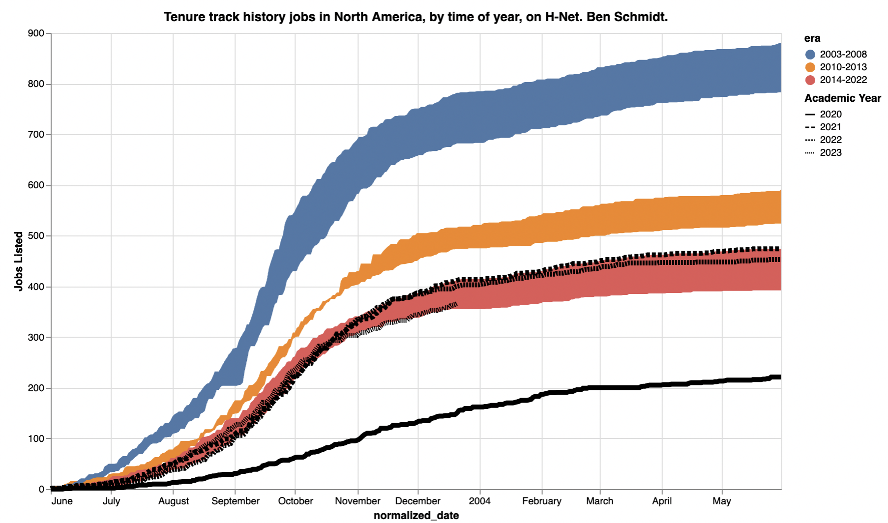
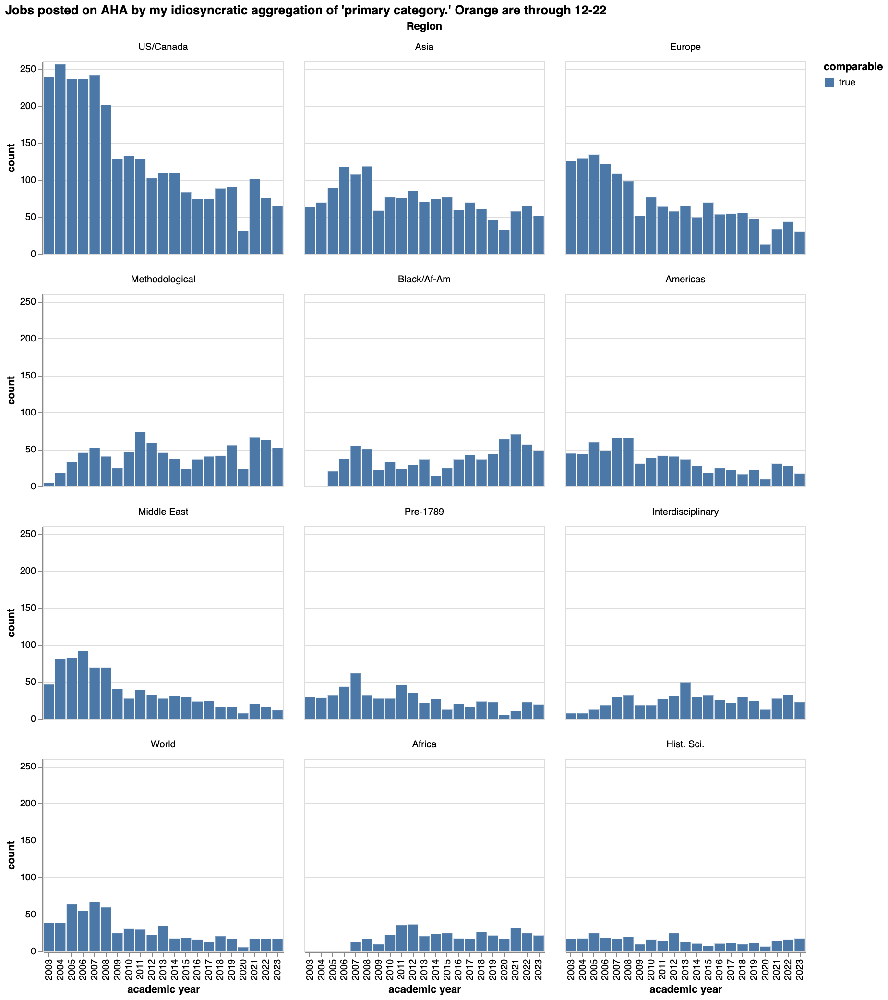

Although I've given up on historically professing myself, I still have a number of automated scripts for analyzing the state of the historical profession hanging around. Since a number of people have asked for updates, it seems worth doing. [As a reminder](https://benschmidt.org/post/2020-10-01-jobs-update/), I'm scraping H-Net for listings. When I've looked at job ads from the American Historical Association's website, they seem roughly comparable. 

The bottom line is: 2023 is shaping up to be one of the worst years for hiring of new history professors yet. The worst year ever, of course, was the pandemic-saddled 2020. The 2009 recession year, which at the time felt calamitous, was actually in the general range of most years since 2014; for me the takeaway remains that while the 2000s were obviously salad days of incredible abundance when tenure track jobs were awarded like candy[^caveat], even the early 2010s were far better than than recent years.

After the 2020 collapse, the question became: would any rebound in the market be permanent, or temporary? 2021 and 2022 were both relatively strong years on the market, by the standards of recent years; and while the 2021 market was concentrated in few modernist fields, 2022 saw a rebound even in early modern and medieval hiring and in the history of Europe, two fields that were starting to be left for dead.[^ahareport]

The answer, it seems, is temporary. After a respectable start to the season, H-net listings in November and December were terrible. There have been just over 350 tenure-track jobs listed this year, compared to 400 listed before Christmas the two years prior. [^phds]

[^phds]: There were 973 PhDs awarded by U.S. departments in 2022.

Notably, there is no pattern in terms of subfields, except for *possibly* a tick up in hiring in history of science. Interdisciplinary fields, African American history, US history, Asian history; all are down by roughly equal shares. There have been times when it seemed like any fields gains might be at the expense of others: now all are lower than they were both last year and than they were in the old days.

[^ahareport]: I say this, in part, to push back on a story told by Leland Grigoli in the [AHA's 2023 jobs report](https://www.historians.org/ahajobsreport2023), which focused heavily on the "relative (and absolute) dearth of jobs for premodernists." While this warning might have been useful in the 2022 report, the pendulum seems to be swinging back away since; and cross-field recriminations have been heavy.

[^caveat]: I kid. Sort of? But also if you have a PhD awarded before 2013
           it would take a great deal of chutzpah to run, like, a placement workshop. Find someone younger, geezer.

